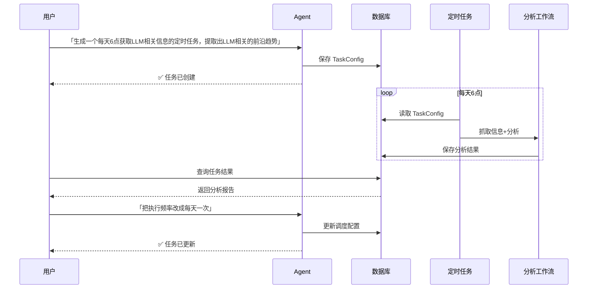
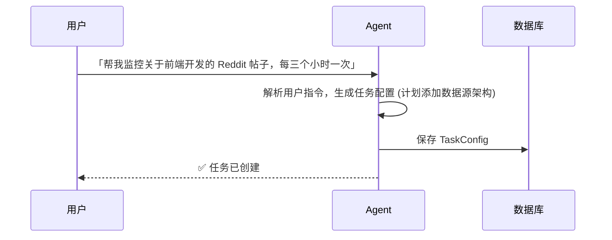
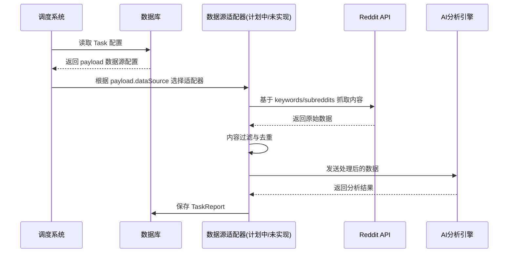
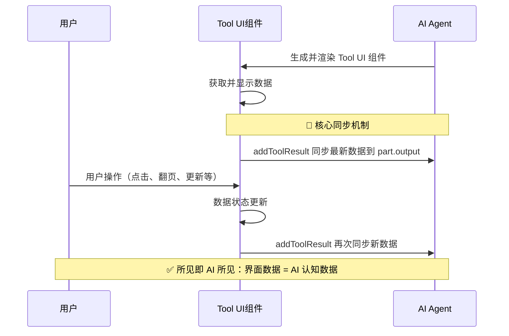

<a href="https://github.com/JinJieBeWater/redgent">
  <h1 align="center">✨ Redgent</h1>
</a>

<p align="center">
    Redgent 是一款基于 Generative UI 的定时任务管理工具，通过对话界面管理定时任务，支持 Reddit 数据抓取和 AI 分析
</p>

<p align="center">
  <a href="#-核心功能特性"><strong>核心功能</strong></a> ·
  <a href="#️-技术栈"><strong>技术栈</strong></a> ·
  <a href="#️-系统架构"><strong>系统架构</strong></a> ·
  <a href="#-快速开始"><strong>快速开始</strong></a> ·
  <a href="#-docker-部署"><strong>Docker 部署</strong></a>
</p>

<div align="center">

[](https://www.typescriptlang.org/) [](https://nestjs.com/) [](https://sdk.vercel.ai/) [](https://trpc.io/) [](https://reactjs.org/) [](https://ui.shadcn.com/) [](https://postgresql.org/) [](https://docker.com/)

</div>

<br/>

# ✨ Redgent

## ✨ 核心功能特性

### 🤖 Agent 交互

- **自然语言交互**: 通过对话式 AI Agent 创建和管理任务
- **Generative UI**: 充分使用生成式用户界面，动态生成交互组件
- **所见即AI所见**: 通过数据同步机制确保用户界面与 AI 认知一致

### ⏰ 灵活的调度系统

- **多种调度模式**: 支持 Cron 表达式和 Interval 两种调度方式
- **校准功能**: 智能校准 Interval 任务执行间隔

### 📊 数据源与分析

- **数据源支持**: 当前支持 Reddit 数据源
- **Reddit 趋势追踪**: 自动监控热门帖子和讨论内容
- **AI 简洁分析**: 使用大语言模型对抓取数据进行简短而高效的分析
- **自动化报告**: 将分析结果整理成清晰的报告，便于快速查阅

### 🎨 现代化 UI/UX

- **响应式设计**: 支持桌面端和移动端自适应布局
- **实时状态显示**: 通过 SSE 推送任务实时执行进度

## 🛠️ 技术栈

### 后端架构

- **[NestJS](https://nestjs.com/)** - 企业级 Node.js 框架
- **[tRPC](https://trpc.io/)** - 端到端类型安全的 API
- **[AI SDK](https://sdk.vercel.ai/)** - 统一的 AI 模型接口
- **[Prisma](https://prisma.io/)** - 现代化 ORM 和数据库工具
- **[PostgreSQL](https://postgresql.org/)** - 可靠的关系型数据库
- **[cache-manager](https://github.com/node-cache-manager/node-cache-manager)** - 统一缓存管理

### 前端架构

- **[React 19](https://react.dev/)** - 现代化前端框架
- **[TanStack Router](https://tanstack.com/router)** - 类型安全的路由管理
- **[TanStack Query](https://tanstack.com/query)** - 强大的数据获取和缓存
- **[shadcn/ui](https://ui.shadcn.com/)** - 高质量 React 组件库
- **[Tailwind CSS v4](https://tailwindcss.com/)** - 原子化 CSS 框架

### 工程化工具

- **[Turborepo](https://turbo.build/repo)** - 高性能构建系统
- **[pnpm](https://pnpm.io/)** - 快速、节省磁盘空间的包管理器
- **[Vitest](https://vitest.dev/)** - 快速的单元测试框架
- **[Docker](https://docker.com/)** - 容器化部署

## 🏛️ 系统架构

### 核心交互流程

下面的序列图展示了典型的用户工作流：



### 任务生成逻辑

将用户的自然语言指令转化为可执行的任务配置：



### 数据抓取与分析流程



### Generative UI 所见即AI所见

通过数据同步机制，确保用户界面与 AI 状态一致。当 AI 生成 Tool UI 组件时，用户看到的数据始终与 AI 的认知保持一致



## 🏗️ 工程化优势

### 🔗 端到端类型安全

- **tRPC 类型安全**: 从后端 API 到前端调用的端到端类型安全
- **AI 工具类型化**: 16+ AI 工具函数（CreateTask、UpdateTask、GetAllTasks 等）全部类型检查
- **共享类型系统**: 通过独立包管理实现跨应用的类型定义复用

### 📦 monorepo 架构

- **数据库层抽离**: 独立的 `@redgent/db` 包统一管理 Prisma 客户端
- **业务逻辑共享**: `@redgent/shared` 提供跨应用的工具函数和类型

## 📂 项目结构

本项目是一个基于 pnpm 工作区的 Monorepo 项目，并使用 [Turborepo](https://turbo.build/repo) 进行任务编排。最终将包含以下核心部分：

```
/
├── apps/
│   ├── core/          # NestJS 后端服务
│   └── web/           # React 前端应用
├── packages/
│   ├── database/      # Prisma 数据库客户端和模型
│   └── shared/        # 共享的类型定义和工具函数
├── tooling/           # 工程化配置
│   ├── eslint-config/     # ESLint 共享配置
│   ├── prettier-config/   # Prettier 共享配置
│   ├── typescript-config/ # TypeScript 共享配置
│   └── tsup-config/       # tsup 构建配置
└── package.json
```

## 🚀 快速开始

### 📋 环境要求

- **Node.js** >= 18
- **pnpm** >= 9.0.0
- **PostgreSQL** 数据库
- **DeepSeek API Key** （用于 AI 功能）
- **Reddit API** 凭证

### 💻 本地开发

1. **数据库准备**

   **方式一：使用本地 Docker 数据库**

   使用脚本快速启动本地 PostgreSQL 数据库：

   ```bash
   # 启动本地 PostgreSQL 容器
   ./start-database.sh
   ```

   该脚本会：
   - 自动从 `.env` 文件读取数据库配置
   - 检查 Docker/Podman 是否安装和运行
   - 创建并启动 PostgreSQL 容器
   - 如果使用默认密码，会提示生成随机密码

   **Windows 用户请注意**：
   1. 需要先安装 WSL (Windows Subsystem for Linux)
   2. 安装 Docker Desktop
   3. 在 WSL 环境中运行脚本

   **方式二：使用云数据库或自建数据库**

   直接在 `.env` 文件中配置你的 PostgreSQL 连接字符串。

2. **克隆项目**

   ```bash
   git clone https://github.com/JinJieBeWater/redgent.git
   cd redgent
   ```

3. **安装依赖**

   ```bash
   pnpm install
   ```

4. **环境配置**

   ```bash
   # 复制环境变量模板
   cp .env.example .env

   # 编辑 .env 文件，填入必要的配置：
   # - REDDIT_CLIENT_ID: Reddit API 客户端 ID
   # - REDDIT_SECRET: Reddit API 密钥
   # - DEEPSEEK_API_KEY: DeepSeek AI API 密钥
   # - DATABASE_URL: PostgreSQL 连接字符串
   # - DIRECT_URL: PostgreSQL 连接字符串
   # - PROXY_URL: (可选) 代理配置
   ```

5. **完成数据库设置**

   ```bash
   # 运行数据库迁移
   pnpm turbo run db:migrate

   # 生成 Prisma 客户端
   pnpm turbo run db:generate
   ```

6. **启动开发服务**

   ```bash
   # 同时启动前后端开发服务器
   pnpm dev
   ```

   访问地址：
   - 前端：http://localhost:3000
   - 后端 API：http://localhost:3001

### 🧪 运行测试

```bash
# 运行所有测试
pnpm test

# 运行集成测试
pnpm test:integration

# 运行 E2E 测试
pnpm test:e2e

# 测试覆盖率
pnpm test:cov
```

### 🔧 开发工具命令

```bash
# 代码检查和格式化
pnpm lint       # ESLint 检查
pnpm format     # Prettier 格式化
pnpm typecheck  # TypeScript 类型检查

# 构建项目
pnpm build      # 构建所有包
```

## 🐳 Docker 部署

### 🚀 快速部署

1. **准备环境文件**

   ```bash
   # 复制并配置环境变量
   cp .env.example .env.production.local
   # 编辑 .env.production.local 填入生产环境配置
   ```

2. **启动服务**

   ```bash
   # 构建并启动所有服务
   docker-compose up -d --build
   ```

   服务访问地址：
   - 前端：http://localhost:3000
   - 后端 API：http://localhost:3001

3. **查看服务状态**

   ```bash
   # 查看运行状态
   docker-compose ps
   ```

## ⚠️ 注意事项

- **数据库**: 确保 PostgreSQL 服务可访问且已创建对应数据库
- **任务频率限制**: Reddit API 有频率限制，且任务会对数据做缓存防止重复分析，过滤频繁的任务会导致数据全部命中缓存取消任务，请合理设置任务间隔
- **代理配置**: 如果在网络受限环境，需要正确配置 `PROXY_URL`
- **端口冲突**: 确保 3000 和 3001 端口未被占用
