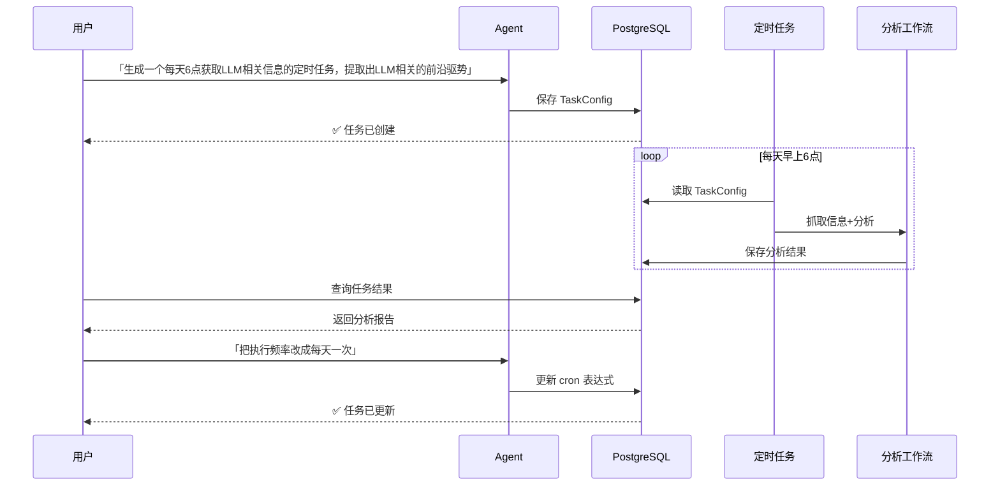
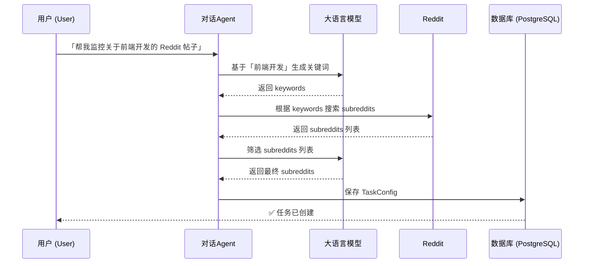
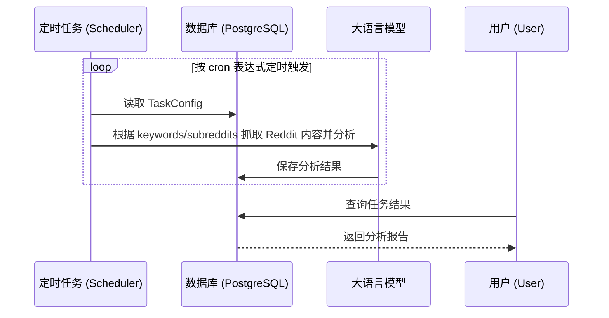
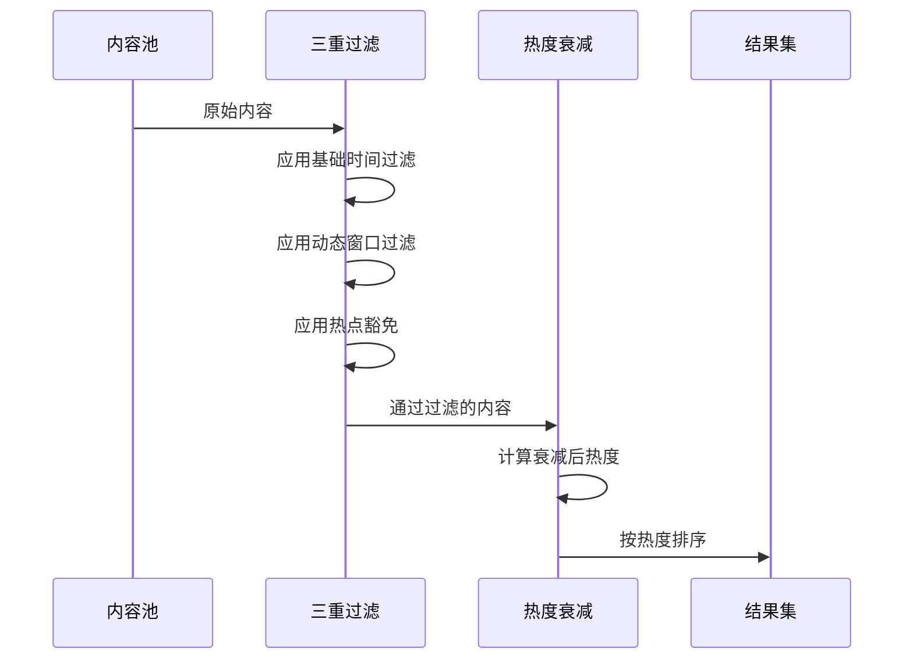

# Redgent

一个基于 Nest.js/React 构建的全栈应用。Redgent 通过定时抓取 Reddit 的实时热点内容，并利用大型语言模型（LLM）进行自动化信息处理，帮助用户高效获取和分析来自社交媒体的关键信息。

## ✨ 主要特性

- **Reddit 趋势追踪**: 创建定时任务，自动监控指定子版块（subreddits）的热门帖子和讨论。
- **LLM 智能分析**: 利用大语言模型，自动提炼 Reddit 帖子的核心观点、情感倾向和关键信息。
- **自动化报告生成**: 将分析结果整理成简洁的报告，方便用户快速回顾和查阅。
- **灵活的任务管理**: 通过友好的界面轻松创建、暂停、编辑和删除你的 Reddit 监控任务。

## 🚀 快速开始

### 1. 安装依赖

克隆项目仓库后，在项目根目录执行以下命令来安装所有依赖：

```bash
pnpm install
```

### 2. 启动开发服务

您可以一键启动所有应用（Web 前端、NestJS 后端等）的开发模式：

```bash
pnpm dev
```

该命令会同时启动：

- `apps/nestjs`: NestJS 后端服务

## 📂 项目结构

本项目是一个基于 pnpm 工作区的 Monorepo 项目，并使用 [Turborepo](https://turbo.build/repo) 进行任务编排。最终将包含以下核心部分：

```
/
├── apps/
│   ├── docs/         # 文档服务 (NextJS)
│   ├── nestjs/       # 后端服务 (NestJS)
│   └── web/          # 前端应用 (React)
├── packages/
│   ├── eslint-config/      # 共享的 ESLint 配置
│   ├── typescript-config/  # 共享的 TypeScript 配置
│   └── ui/                 # 共享的 React UI 组件库
└── package.json
```

## 🤖 核心交互逻辑

下面的序列图展示了典型的用户工作流：



## 🤖 任务生成逻辑

此阶段的核心是将用户的自然语言指令转化为一个精确、可执行的任务配置。

当用户输入指令（例如：“帮我创建一个任务，每天抓取关于前端开发的最新讨论”）时，系统会：

1.  **提取核心关键字**: 从指令中识别出核心主题，如“前端开发”。
2.  **LLM 智能扩展**: 将核心主题交由大语言模型（LLM）进行分析，生成一组相关的英文搜索关键词（`keywords`）。
3.  **发现相关社区**: 使用 `keywords` 在 Reddit 上搜索相关的子版块（`subreddits`）。
4.  **LLM 智能筛选**: 将搜索到的 `subreddits` 列表交由 LLM 进行筛选，选出最相关的一部分。
5.  **创建任务配置**: 最后，将定时规则、关键词和筛选后的社区列表存入数据库，形成一个具体的 `TaskConfig`。



## 🤖 任务执行逻辑

任务创建后，调度器会根据其 `cron` 表达式定时触发执行。

执行流程如下：

1.  调度器从数据库中读取到期的任务配置。
2.  根据配置中的 `keywords` 和 `subreddits`，从 Reddit 抓取相关帖子。
3.  将抓取到的内容交由 LLM 进行分析、总结。
4.  最终的分析报告被存回数据库，等待用户查询。



## 🤖 Reddit 抓取逻辑


