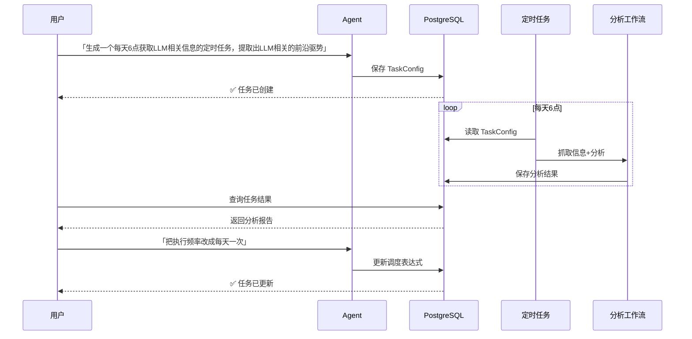
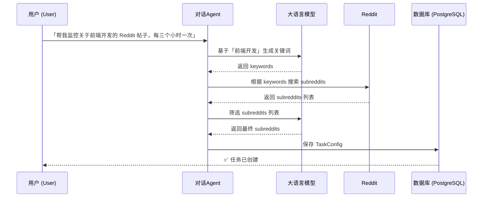
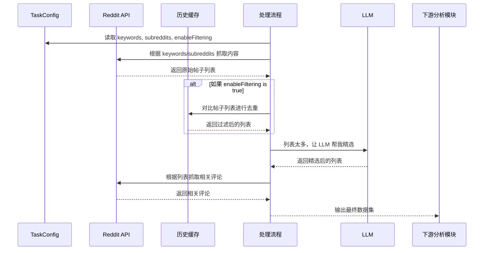
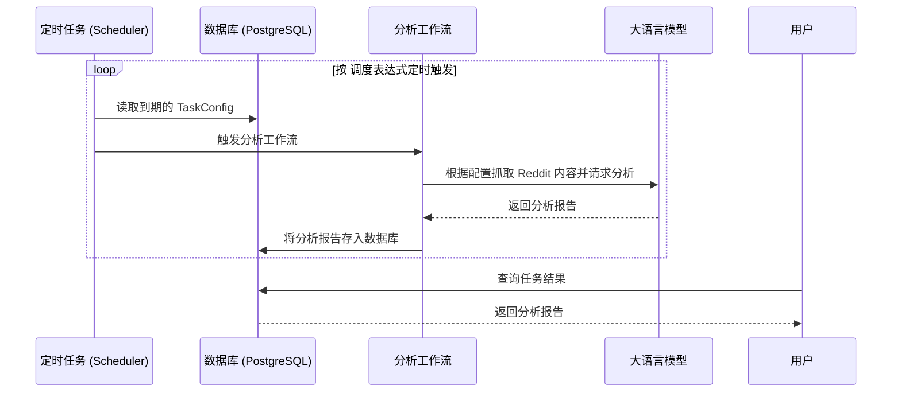

# Redgent

一个基于 Nest.js/React 构建的全栈应用。Redgent 通过定时抓取 Reddit 的实时热点内容，并利用大型语言模型（LLM）进行自动化信息处理，帮助用户高效获取和分析来自社交媒体的关键信息。

## ✨ 主要特性

- **Reddit 趋势追踪**: 创建定时任务，自动监控热门帖子和讨论。
- **LLM 智能分析**: 利用大语言模型，自动提炼 Reddit 帖子的核心观点、情感倾向和关键信息。
- **自动化报告生成**: 将分析结果整理成简洁的报告，方便用户快速回顾和查阅。
- **灵活的任务管理**: 通过 Agent 对话，可以实现任务的自动化和管理。

## 🛠️ 技术栈

- **后端**: [Nest.js](https://nestjs.com/), TypeScript
- **前端**: [React](https://react.dev/), TypeScript
- **数据库**: PostgreSQL (Prisma)
- **Monorepo 工具**: [Turborepo](https://turbo.build/repo), [pnpm](https://pnpm.io/)

## 📂 项目结构

本项目是一个基于 pnpm 工作区的 Monorepo 项目，并使用 [Turborepo](https://turbo.build/repo) 进行任务编排。最终将包含以下核心部分：

```
/
├── apps/
│   ├── nestjs/       # 后端服务 (NestJS)
│   └── web/          # 前端应用 (React)
├── packages/
│   ├── eslint-config/      # 共享的 ESLint 配置
│   ├── typescript-config/  # 共享的 TypeScript 配置
│   └── ui/                 # 共享的 React UI 组件库
└── package.json
```

## 🤖 核心交互逻辑

下面的序列图展示了典型的用户工作流：



## 🤖 任务生成逻辑

此阶段的核心是将用户的自然语言指令转化为一个精确、可执行的任务配置。

当用户输入指令（例如：“帮我创建一个任务，每天抓取关于前端开发的最新讨论”）时，系统会：

1.  **提取核心关键字**: 从指令中识别出核心主题，如“前端开发”。
2.  **LLM 智能扩展**: 将核心主题交由大语言模型（LLM）进行分析，生成一组相关的英文搜索关键词（`keywords`）。
3.  **发现相关社区**: 使用 `keywords` 在 Reddit 上搜索相关的子版块（`subreddits`）。
4.  **LLM 智能筛选**: 将搜索到的 `subreddits` 列表交由 LLM 进行筛选，选出最相关的一部分。
5.  **创建任务配置**: 最后，将定时规则、关键词和筛选后的社区列表存入数据库，形成一个具体的 `TaskConfig`。



## 🤖 Reddit 抓取逻辑

抓取逻辑根据 `TaskConfig` 的配置来执行：

1.  **数据源**: 根据任务中指定的 `subreddits` 和 `keywords`，从 Reddit API 并行抓取相关的热门帖子，汇集成原始内容池。
2.  **过滤与去重**: 如果 `TaskConfig` 中的 `enableFiltering` 选项为 `true`，系统会启用缓存机制。它会将当前抓取到的内容与历史缓存进行对比，过滤掉那些在近期（如过去36小时内）已经处理过的帖子，从而有效避免重复分析。
3.  **生成结果集**: 最终，将排序后的帖子列表作为可分析的数据集，交由下游的分析模块进行处理。

下面的序列图展示了这个过程：



## 🤖 任务执行逻辑

任务创建后，调度器会根据其调度表达式定时触发执行。

执行流程如下：

1.  调度器从数据库中读取到期的任务配置。
2.  根据配置触发分析工作流，工作流会根据 `keywords` 和 `subreddits` 从 Reddit 抓取相关帖子。
3.  将抓取到的内容交由 LLM 进行分析、总结，生成报告。
4.  最终的分析报告被存回数据库，等待用户查询。


